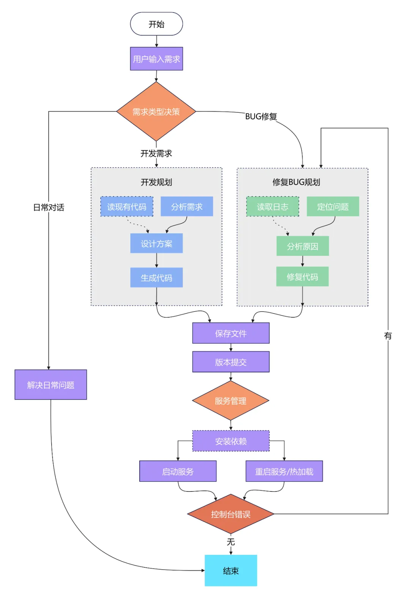

# 代码生成系统示例

本项目演示一个基于 LangGraph 的“需求→设计→代码生成→保存→版本快照→服务启动→错误检查”的自动化流程，用于学习LangGraph在代码生成中的使用。



## 代码结构

- `main.py`：命令行入口，解析 `--repo`、`--service`、`--request`，执行流程并以 JSON 打印结果。
- `app/graph.py`：LangGraph 编排与节点注册，定义从分流到保存/版本/服务/错误检查的完整流程与条件边。
- `app/nodes.py`：核心节点实现，包含分流、代码读取、需求分析、系统设计、代码生成（arc-file 协议）、文件写入、Git 提交、服务管理（安装与启动）、日志读取与问题定位。
- `app/llm.py`：OpenRouter 客户端封装，加载 `.env` 配置并调用 `chat.completions`，在缺失或无效 API Key 时打印错误信息。

## 特性

- 流程编排：`classify（分流） → read_code（读取代码） → analyze_requirements（需求分析） → design_solution（系统设计） → generate_code（生成代码） → save_files（保存文件） → version_commit（版本提交） → service_manage（服务管理） → check_console_errors（控制台错误检查）`。
- 需求分流：自动归类为 `dev`、`bugfix` 或 `qna`。
- 代码生成约定：从大模型返回 <arc-file type="file/shell" path=""></arc-file>，提取 `files/shell`。
- 服务启动策略：优先使用模型返回的启动命令，其次按项目类型自动推断（Java/PHP/Go/Node/Python）。
- 关键日志打印：分流结果、采样文件数量、计划/设计摘要、解析错误与原始片段、保存数量、提交信息、服务启动状态。

## 环境要求

- Python `3.10+`
- `git`（用于版本快照），`node`/`npm`、`Java`/`Maven`/`Gradle`、`PHP`、`Go`（用于不同项目类型的服务启动）
- 在线模型：OpenRouter API Key

## 安装

- 创建并启用虚拟环境与安装依赖（项目根目录）：
  - `python -m venv .venv`
  - `.venv\Scripts\python -m pip install -r requirements.txt`

## 配置

- 在项目根目录创建 `.env`（已内置自动加载）：
  - `OPENROUTER_API_KEY=<你的 OpenRouter API Key>`
  - `OPENROUTER_MODEL=anthropic/claude-sonnet-4`

## 运行示例

  - `.venv\Scripts\python main.py --repo ./temp/ --request "开发一个oa系统 使用python fastapi sqlite数据库"`

## 模型返回约定

- 推荐返回 arc-file 标签（不包含解释与 Markdown）：

```
<arc-file type="file" path="app/main.py">from fastapi import FastAPI
app = FastAPI()
@app.get("/")
def hello():
    return {"ok": True}
</arc-file>

<arc-file type="shell">pip install -r requirements.txt && uvicorn app.main:app --host 0.0.0.0 --port 8000 --reload</arc-file>
```

- 说明：
  - `type="file"`：用于写入新文件或更新现有文件，`path` 为相对仓库根路径；内容为完整源码
  - `type="shell"`：用于输出命令，多行表示多条命令；最后一行视为启动命令，其余为依赖安装命令
  - 若未提供命令，系统会按仓库类型自动推断（见下文）

## 服务启动策略

- 优先使用模型返回的shell命令
- 自动推断兜底（常见项目类型）：
  - Node：`npm install` → `npm run dev`
  - Java：`mvn -q -DskipTests package` → `mvn spring-boot:run`（或使用 `mvnw.cmd`/`gradlew.bat`）
  - PHP：`composer install` → `php artisan serve --host 0.0.0.0 --port 8000`（或 `php -S 0.0.0.0:8000`）
  - Go：`go mod tidy` → `go run .`
  - Python（FastAPI）：`uvicorn app.main:app --host 0.0.0.0 --port 8000 --reload`

## 调试与日志

- 关键打印（终端可见）：
  - `type`：分流类型（`dev/bugfix/qna`）
  - `read_code`：采样文件数量
  - `plan/design`：文本摘要
  - `generate_code parse_error` 与 `raw`：解析失败与原始片段（截断）
  - `generate_code/fix_code`：生成/修复的文件数量
  - `save_files`：写入文件数量
  - `commit`：提交信息
  - `service_started`：服务启动状态

## 常见问题

- 401 认证失败（OpenRouter）：
  - 检查 `.env` 中 `OPENROUTER_API_KEY` 是否有效；重开终端再运行；
  - 模型名无效会导致 400（例如 `anthropic/claude-sonnet-4`）；建议使用 `anthropic/claude-3.5-sonnet`。
- 解析错误 `Expecting value: line 1 column 1 (char 0)`：
  - 通常是返回为空或不是 JSON；请按“模型返回约定”生成；
  - 系统会打印 `raw` 片段帮助定位。
- 未生成文件但服务要启动：
  - 可配置模型返回最小入口文件；或让系统兜底（例如自动生成 FastAPI 入口）。

## 待完善与规划

- 模型降级策略：OpenRouter 不可用时本地离线回退，自动生成最小 arc-file 模板与命令。
- 提示词规范化：统一各节点提示，明确 arc-file 字段含义；可选 `type="install"/"start"` 标签。
- 解析器增强：支持属性转义、空标签校验、错误定位行号与片段截断规则。
- 多语言识别扩展：补充 Rust/.NET/Scala；Node 常见框架（Next/Nest/Vite）启动识别。
- 命令执行健壮性：超时/重试、跨平台兼容（PowerShell/bash）、环境隔离与依赖缓存。
- 日志采集改进：后端日志路径自动发现、前端控制台捕获、着色与关键字高亮。
- 流程容错：异常重试、断点续跑、图状态持久化（文件/SQLite）。
- 安全治理：敏感文件检测（`.env`、密钥、证书）、历史清理指引与自动提示。
- 质量保障：单元/集成测试，`lint`/格式化、类型检查；提供标准命令与 CI 配置示例。
- 配置化能力：采样文件模式、生成阈值、超时参数、服务端口等通过配置文件管理。
- 版本管理优化：提交信息模板、changelog 生成、标签与发布流程。
- 交互体验：CLI 交互参数校验、进度条与阶段性结果展示、输出收敛与日志级别控制。
- 文档与示例：arc-file 协议详细说明、跨语言示例仓库、常见错误与排障手册。

## 许可证

- 仅用于学习。

## 学习交流

- 欢迎关注 微信公众号 

